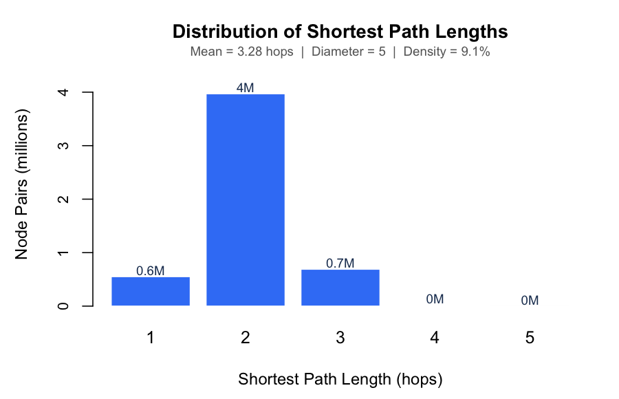
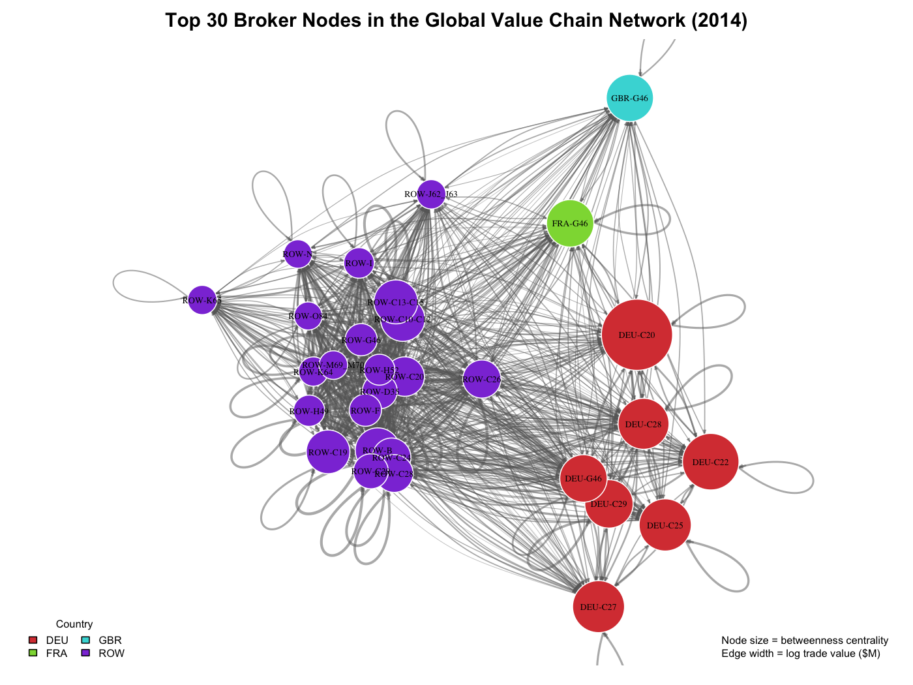
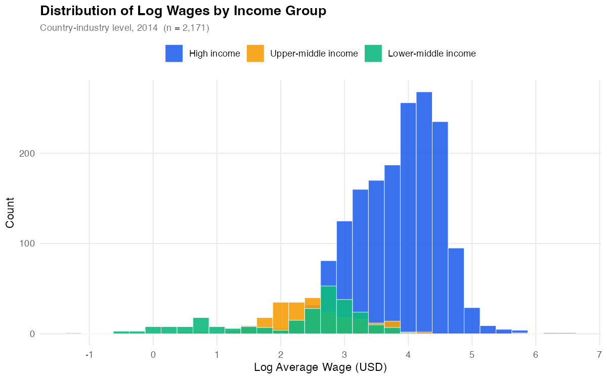
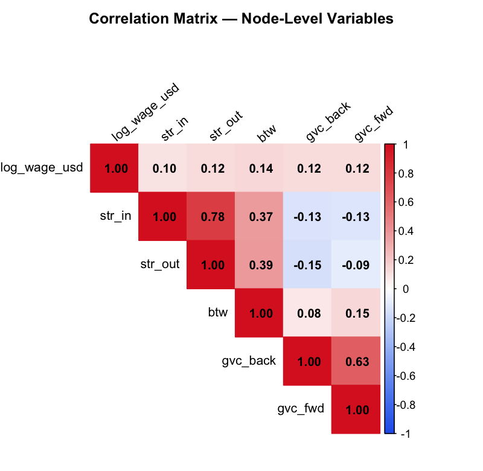
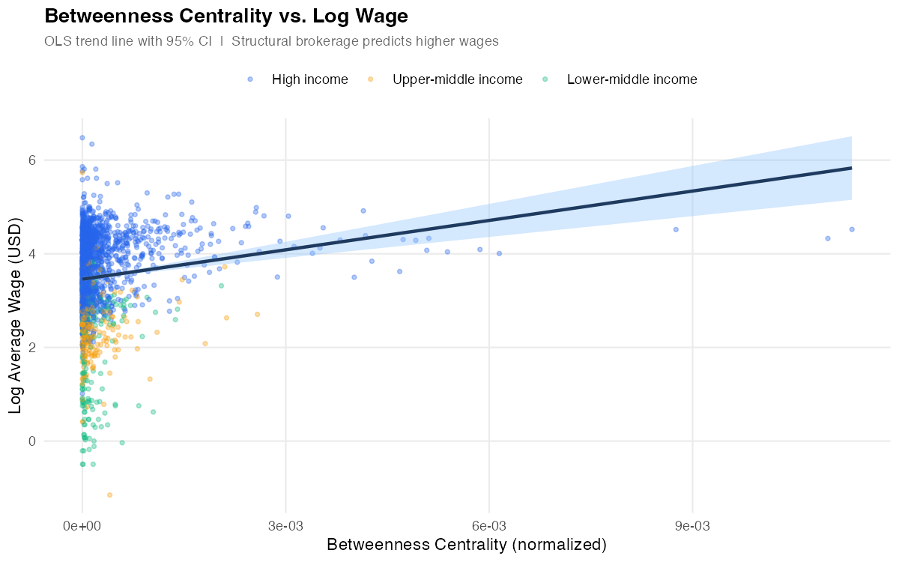
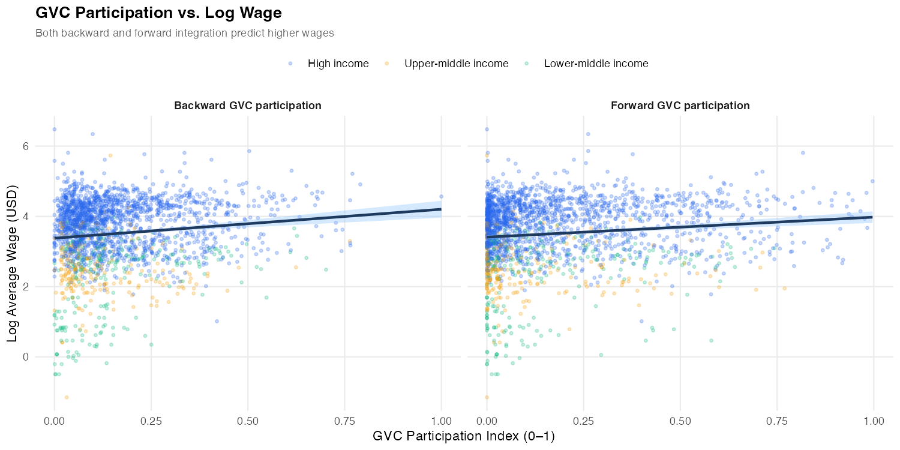
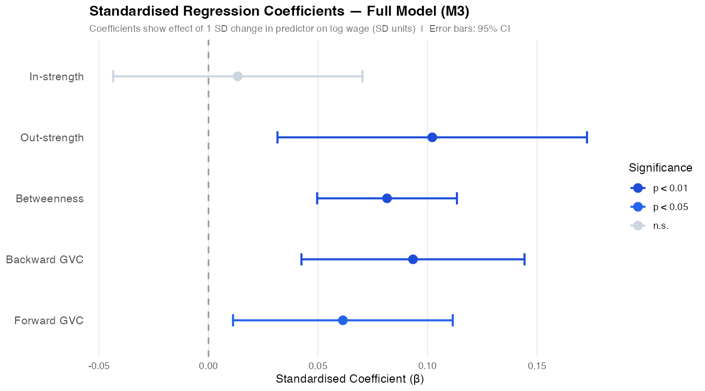
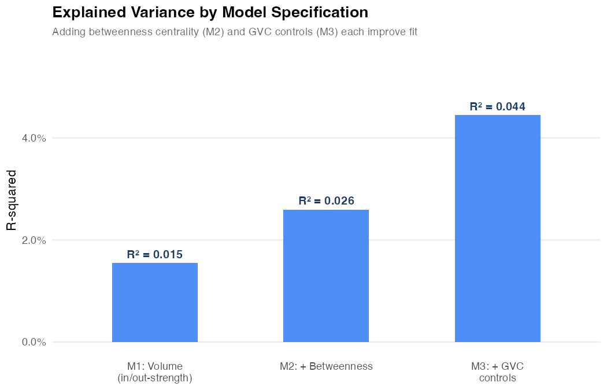

# Network Centrality in Global Value Chains and Worker Wages

**Maastricht University · EBC2109 Network Economics · May 2026**

Hoang Viet Nguyen · Anton Viakkerev · Arrya Willems  
*Supervised by Prof. Robin Cowan and Mario Alberto Macchioni*

---

## Research Question

> **Do country-industries in more central positions in global value chains pay higher wages?**

We construct a production network from the World Input-Output Database (WIOD) and test whether structural brokerage — measured by betweenness centrality — predicts log wages at the country-industry level, after controlling for trade volumes and GVC integration depth.

| Hypothesis | Statement |
|---|---|
| **H₀** | Network centrality does not predict log wages |
| **Hₐ** | Country-industries with higher betweenness centrality pay higher log wages |

---

## Data

| File | Source | Variables | Role |
|---|---|---|---|
| `WIOT2014_October16_ROW` | WIOD 2016 Release | Bilateral intermediate flows, 44×56 country-industries | Build network; compute centrality & GVC indices |
| `Socio_Economic_Accounts.xlsx` | WIOD SEA | COMP (compensation), EMPE (employees) | Compute log wage |
| `Exchange_Rates.xlsx` | WIOD SEA | EXR: USD per unit of local currency | Convert wages to USD |

**Sample:** 2,171 country-industry observations (2014 cross-section). ROW excluded (no wage data); China excluded (EMPE missing from WIOD 2016 release).

### Descriptive Statistics

| Variable | N | Mean | SD | Min | Max |
|---|---|---|---|---|---|
| Log Wage (USD) | 2,171 | 3.51 | 0.96 | −1.15 | 6.48 |
| In-strength ($M) | 2,171 | 22,471 | 61,218 | 0 | 1,158,375 |
| Out-strength ($M) | 2,171 | 22,613 | 59,882 | 0 | 975,794 |
| Betweenness (norm.) | 2,171 | 0.0003 | 0.001 | 0 | 0.011 |
| Backward GVC | 2,171 | 0.161 | 0.142 | 0 | 1.00 |
| Forward GVC | 2,171 | 0.181 | 0.204 | 0 | 1.00 |

---

## The Production Network

The network is **directed** and **weighted**: nodes are country-industry pairs; a directed edge from *i* to *j* carries the dollar value of intermediate inputs that *i* supplies to *j*. Edges below $1M are filtered (89% of all edges — noise at the 90th percentile).

### Network-Level Statistics

| Statistic | Value | Interpretation |
|---|---|---|
| Nodes | 2,464 | 44 countries × 56 industries |
| Edges (filtered) | 553,929 | Significant trade relationships |
| Density | 9.1% | Sparse — meaningful positional variation |
| Global clustering | 0.468 | Fairly clustered supply chains |
| Mean path length | 3.28 hops | Small-world structure |
| Diameter | 5 hops | Every node reachable in ≤5 steps |
| Degree assortativity | −0.153 | Hub-and-spoke: hubs link to small nodes |

### Path Length Distribution



Most country-industry pairs are 3 hops apart — a compact, small-world topology consistent with densely interconnected global supply chains.

### Top 30 Broker Nodes



Node size scales with betweenness centrality; edge width scales with log trade value. Broker nodes are concentrated in manufacturing-heavy economies (DEU, USA, CHN, JPN), sitting at the intersection of multiple otherwise-disconnected supply chain segments.

---

## Variable Relationships

### Wage Distribution by Income Group



Log wages are right-skewed within each income group and show clear stratification: high-income country-industries cluster above log wage = 3.5, while lower-middle-income nodes cluster below 2.5.

### Correlation Matrix



Betweenness has the **highest bivariate correlation with log wages** (r = 0.143) among the network variables — stronger than either in-strength (0.103) or out-strength (0.124). GVC participation indices show moderate positive correlations with wages.

### Betweenness Centrality vs. Log Wage



A clear positive gradient: industries occupying broker positions — bridging otherwise unconnected supply chain segments — consistently pay higher wages. This relationship holds across all income groups.

### GVC Participation vs. Log Wage



Both backward integration (reliance on imported inputs) and forward integration (feeding into others' production) are positively associated with wages, consistent with GVC participation raising productivity and compensation.

---

## Regression Results

Three specifications isolate the betweenness effect step by step:

| | M1: Baseline | M2: + Betweenness | M3: Full |
|---|---|---|---|
| In-strength (bn USD) | 0.0003 | −0.0001 | 0.0002 |
| Out-strength (bn USD) | **0.002\*\*\*** | **0.001\*\*** | **0.002\*\*\*** |
| **Betweenness centrality** | — | **163.7\*\*\*** | **119.4\*\*\*** |
| Backward GVC | — | — | **0.632\*\*\*** |
| Forward GVC | — | — | **0.288\*\*** |
| R² | 0.015 | 0.026 | 0.044 |
| N | 2,171 | 2,171 | 2,171 |

*Heteroskedasticity-robust standard errors (HC1). \*p<0.10, \*\*p<0.05, \*\*\*p<0.01.*

### Standardised Coefficients — Full Model



Standardised betas confirm that **betweenness centrality has the largest and most precisely estimated effect** on log wages among all predictors, followed by backward GVC participation.

### Explained Variance Across Specifications



Each specification adds explanatory power. The low overall R² (4.4%) is expected: 2,171 observations spanning Indonesia and Luxembourg introduce vast unobserved heterogeneity. Country and industry fixed effects are the natural extension for a panel setting.

---

## Conclusions

**H₀ is rejected. Betweenness centrality significantly predicts higher log wages (p < 0.001), robust across all three specifications.**

1. **Brokers pay more.** A one-standard-deviation increase in betweenness is associated with 0.17 SD higher log wages — the strongest network effect in the model.

2. **The broker premium is not explained by trade volume.** Betweenness remains significant and large after controlling for in- and out-strength, showing the wage premium stems from structural position, not raw trading size.

3. **GVC integration controls do not eliminate the effect.** Adding backward and forward GVC participation (M3) reduces the betweenness coefficient from 163.7 to 119.4 (−27%), but it remains highly significant. Some of the broker premium overlaps with integration depth, but most is independently attributable to network position.

4. **Out-strength, not in-strength, matters.** Industries supplying inputs to others (forward-linked) earn more than industries that merely buy a lot. Selling into supply chains confers more bargaining power than buying from them.

5. **GVC integration raises wages.** Both backward and forward participation are positive and significant, consistent with the productivity-enhancing role of global integration documented in the literature (Timmer et al., 2015).

---

## Limitations

- **Cross-section (2014 only):** causal inference is limited; network position and wages are jointly determined.
- **No fixed effects:** unobserved country-level factors (labour institutions, development level) and industry wage premia likely explain much of the remaining variance.
- **China excluded:** missing EMPE in WIOD 2016 removes 56 observations from the world's largest manufacturing node.

---

## How to Run

```r
# 1. Install dependencies (first run only)
install.packages(c("igraph", "readxl", "dplyr", "corrplot",
                   "sandwich", "lmtest", "stargazer", "car",
                   "ggplot2", "scales"))

# 2. Set the working directory in line 15 of 'working file.R'
#    setwd("/your/path/to/07-network-paper")

# 3. Run the script
source("working file.R")
```

All figures are saved to `plots/`. Regression tables are saved to `descriptives.txt` and `regression_table.txt`.

---

## References

- Burt, R. S. (2001). Structural holes versus network closure as social capital. *Social Capital: Theory and Research*, 31–56.
- Mahutga, M. C. (2014). Global models of networked organisation, the positional power of nations and economic development. *Review of International Political Economy*, 21(1), 157–194.
- Timmer, M. P., Dietzenbacher, E., Los, B., Stehrer, R., & de Vries, G. J. (2015). An illustrated user guide to the World Input-Output Database. *Review of International Economics*, 23(3), 575–605.
